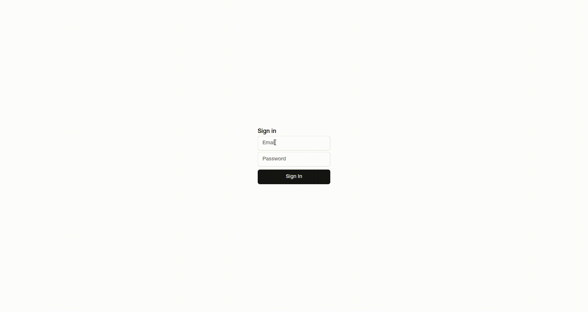
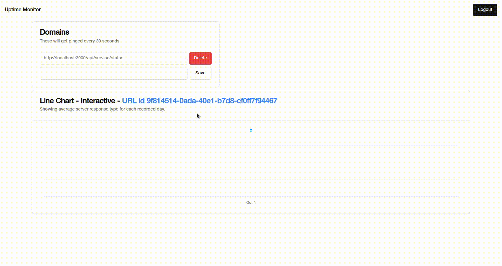

# Uptime Monitor

In order to run the application you need both the client and the app.

### Running the Uptime Monitor Worker Application

1. `git clone https://github.com/SzymanskiFilip/uptime-monitor-worker.git`
2. `cd uptime-monitor-worker`
3. run `docker compose up -d` or the shell script `sh ./cleanup.sh`
4. run the app with `go run main/main.go`

### Running the Uptime Montior Client

1. `git clone https://github.com/SzymanskiFilip/uptime-monitor-client.git`
2. `cd uptime-monitor-client`
3. `npm i`
4. `npm run dev`

## Showcase

Mock Authentication and adding URL for the worker to ping periodically

URL Page with statistics generated in the current time

URL Page with dummy generated statistics added in order to have more data in the charts.

